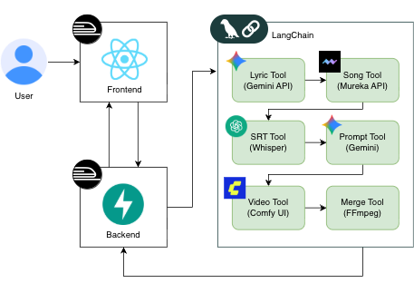

# 눈송AI — 나만의 공부 비서

> **수업 필기나 PDF를 넣으면 핵심만 쏙 정리하여, 관련 영상과 노래까지 만들어준다!**

숙명여자대학교 2025 SMU EDU EXPO 출품작 (동상) <br>
팀명: **와 너 정말 \*핵심\*을 찔렀어** | 김진영 · 정민주 · 최은소 | 지도교수: 이기용

---

## 프로젝트 개요

긴 강의 자료나 PDF의 부담을 줄이고, **음악·영상 기반 학습**으로 암기를 돕는 AI 서비스입니다.

학습 내용을 입력하면 LangChain 자율 에이전트가 가사 생성 → 음악 생성 → 자막 생성 → 영상 생성 → 병합까지 전 과정을 자동으로 수행하여 **숏폼 학습 영상 한 편**을 완성해 줍니다.

### 기획 배경

- '김햄찌' 스타일의 컨텍스트-AI 숏폼 콘텐츠가 유행하며 생성형 AI를 활용한 학습 서비스 수요 증가
- 단순 암기가 필요한 내용을 노래·영상으로 변환하여 이동 중 자투리 시간에도 반복 학습 가능
- Text → Audio → Video를 아우르는 **다중 모델 융합 파이프라인** 구축 역량 함양

---

## 주요 기능

| 단계 | 도구 | 설명 |
|------|------|------|
| **1. 가사 생성** | Gemini API | 입력된 PDF 내용을 요약하여 학습용 가사 생성 |
| **2. 음악 생성** | Mureka API | 가사를 바탕으로 AI 음악 생성 |
| **3. 자막 생성** | OpenAI Whisper | 생성된 오디오를 분석하여 SRT 자막 파일 생성 |
| **4. 영상 프롬프트** | Gemini API | 자막 내용을 기반으로 영상 생성용 프롬프트 작성 |
| **5. 영상 생성** | ComfyUI | AI 영상 생성 서버에 클립 생성 요청 (병렬 처리) |
| **6. 최종 병합** | FFmpeg | 자막 · 음악 · 영상을 합쳐 숏폼 영상 완성 |

---

## 데모 영상

<video src="presentation/demo_video.mp4" controls width="100%"></video>

> 영상이 재생되지 않으면 [여기서 직접 다운로드](presentation/demo_video.mp4)해주세요.

---

## 서비스 아키텍처



---

## 기술 스택

### Frontend
- React 19 + TanStack React Query
- Axios (비동기 API 통신, 4초 간격 폴링으로 생성 상태 확인)

### Backend
- FastAPI + Uvicorn
- LangChain / LangGraph — 자율 에이전트(Autonomous Agent) 오케스트레이션

### AI 모델
- Google Gemini 2.5-Flash — 가사 생성, 영상 프롬프트 생성
- Mureka API — AI 음악 생성
- OpenAI Whisper (stable-ts) — 음성 → 자막 변환
- ComfyUI — AI 영상 클립 생성 (WebSocket 통신)

### 영상/오디오 처리
- FFmpeg — 자막·음악·영상 병합
- PyDub, Torchaudio

### 배포
- Docker + Railway (클라우드 배포)
- GitHub main 브랜치 머지 시 자동 배포 파이프라인

---

## 프로젝트 구조

```
Haeksim_Noonsongi/
├── haeksim-noonsongi/      # React 프론트엔드
├── agent_lang/             # LangChain 에이전트 오케스트레이션
├── lyric/                  # 가사 생성 (Gemini API)
├── song/                   # 음악 생성 (Mureka API)
├── srt/                    # 자막 생성 (Whisper)
├── video_prompt/           # 영상 프롬프트 생성 (Gemini)
├── video/                  # 영상 생성 (ComfyUI, 병렬 배치 처리)
├── merge_video/            # 영상·음악·자막 병합 (FFmpeg)
├── comfyui/                # ComfyUI Docker 설정
├── api.py                  # FastAPI 백엔드 서버
├── main.py                 # CLI 진입점
├── requirements.txt
└── Dockerfile
```

---

## 사용 방법

1. 웹 화면 접속 후 학습하고 싶은 PDF 파일 업로드
2. 원하는 스타일이나 요청사항을 프롬프트로 입력
3. 생성 버튼 클릭 → LangChain 에이전트가 자동으로 전 과정 수행
4. 완성된 숏폼 학습 영상을 웹에서 바로 시청

> 개인정보 보호: 업로드된 PDF 파일은 AI 모델 재학습에 사용되지 않습니다.

---

## 주요 성과

- **영상 생성 시간 단축**: 비디오 배치 병렬 처리 도입으로 10분 → 4분으로 단축
- **자동 배포 파이프라인**: GitHub main 브랜치 머지 시 Railway 자동 배포
- **안정적인 비동기 처리**: 생성형 AI의 긴 레이턴시를 고려한 비동기 통신 구조 설계

---

## 팀원

| 이름 | 역할 |
|------|------|
| 김진영 | 데이터 엔지니어 — LangChain 에이전트 설계, AI 파이프라인 구축 |
| 정민주 | 프론트엔드 개발자 — React UI, API 연동 |
| 최은소 | DevOps — Docker 컨테이너화, 배포 파이프라인 구축, LangChain 에이전트 설계 |
